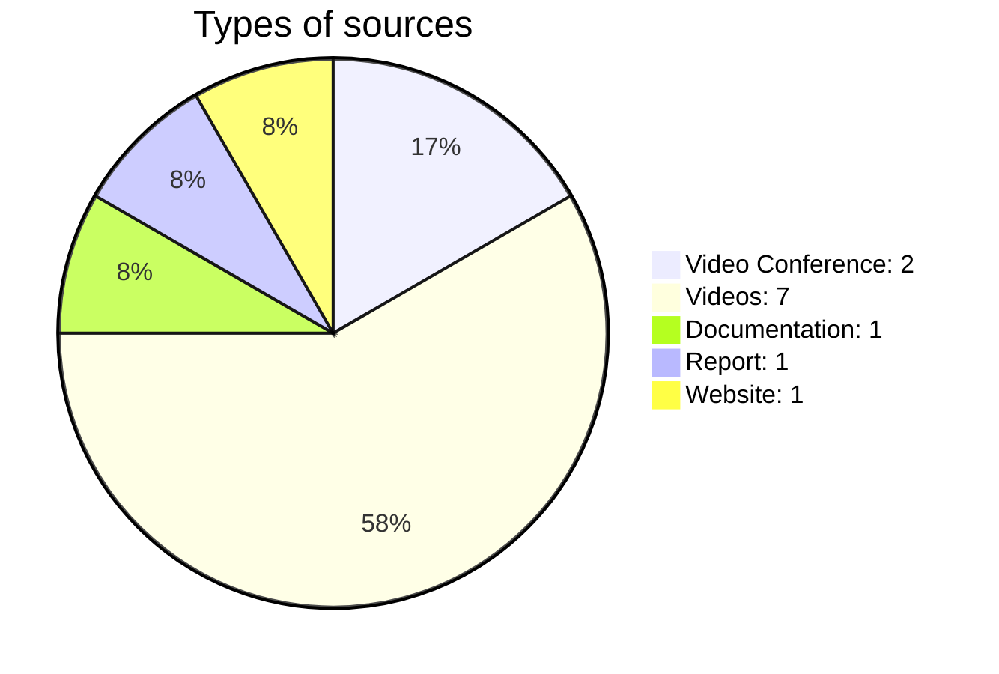

To properly reference a source I knew I need a title, link and date accessed. This is the type of referencing that I use for my physics A-level so I thought it might be good practice to use it in my EPQ. The method used was Harvard referencing, as it clearly states all the information needed to access the site and the data allows the version of the site to be referenced as it could change after I initially accessed it, so the date accessed accounts for this. 
![[Sources Table.png]]
To evaluate my sources I decided to use a modified version of the CRAAP method:
- Currency
	- How recent is the information
	- Forced me to question weather the methods discussed are still viable or if there are more recent methods which outperform the old ones, this didn't really apply to the methods as they were more general ideas rather than established steps to follow. On the other hand the blender tutorials had established steps to follow so I had to make sure that the source is up to date with the current version of blender 
- Relevance
	- How important is the information is to my artefact
	- Since there are a lot of videos about blender, but not all of them contain the information that I need, or to the level of detail that I require.
- Usability (added by me)
	- How can the information be used in my project. 
	- Even if the information is relevant to my project I still need to implement it in some sort of way. Forcing me to think weather the method discussed will fit into my workflow and add to the project.
- Authority
	- The source of the information. 
	- This wasn't that useful in my case since I could try the methodology from the source and if it worked then the source was credible and if it didn't then the source wasn't credible. Though some videos were from more credible channels which have established their knowledge in the blender community.
- Accuracy
	- The reliability and correctness of the information.
	- This also wasn't very useful as if the method discussed worked then the source was accurate and if it didn't then the source wasn't accurate. Though some sources explained their methodology better than others which was what I focused on in this sections
- Purpose
	- The reason the information exists
	- This was often hard to discover since I couldn't find anything about the publishers of the reports. But for most of the videos it was easy to determine the purpose of the information. 

*Doesn't include the sources that weren't used*

Though I had a lot of reports that I could read through I didn't end up using most of them since I wanted to develop my own methodology and not use someone else's. Most of my sources of information were videos, this is because I found it really helpful when there was someone talking me through the method and explaining why it works rather than just showing it, primarily using videos is something that I will continue to use in the future as this project helped me realise that it's a method that works for me. Though the documentation was only one source I don't think the pie chart represents how useful it was since it was the only source that I kept revisiting throughout the course of the entire project. 