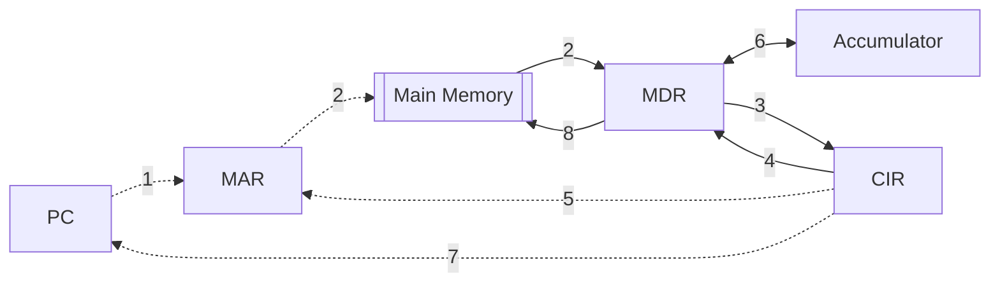

Dotted line - [[Busses |Address bus]]
Default line - [[Busses |Data bus]]

**Fetch phase**
1. Address of next instruction is copied from [[Registers|PC]] to  [[Registers|MAR]]
2. Data at that address is copied to  [[Registers|MDR]],  [[Registers|PC]] increments
3. Content of  [[Registers|MDR]] is copied to  [[Registers|CIR]]

**Decode phase**
- Instruction is split into opcode and operand
	- opcode determines what hardware executes it
	- operand holds either:
		4. the actual data which is copied to  [[Registers|MDR]]
		5. the address of the data to be used with the operation which is then coped to  [[Registers|MAR]]
		6. the data to be operated on may be passed to ALU/ [[Registers|accumulator]]

**Execute phase**
7. if there is a branch operation address is copied from  [[Registers|CIR]] to  [[Registers|PC]]
8. result is written to [[Main Memory|memory]]

This cycle constantly repeats