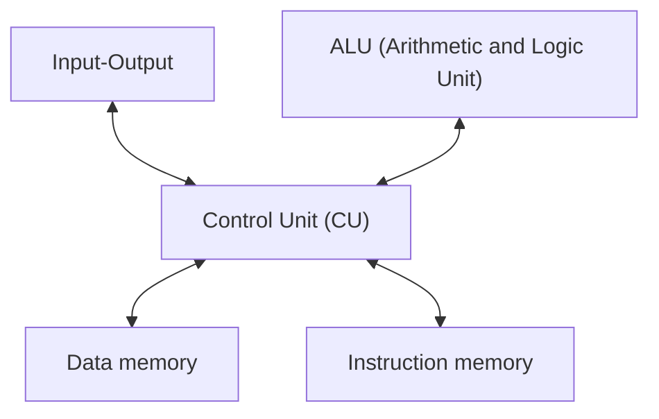

- Has 2 memories, one for data and one for instructions
- More common in [[Embedded System|embedded processors]] as instruction memory can be read only since machine only has one purpose

Adv | Dis
-- | --
Quicker execution as data and instruction can be fetched in parallel| More Expensive to develop as [[Control Unit (CU)]] is harder to design
[[Main Memory\|Memories]] can be different sizes, which can make a more efficient use of space | Programs tend to be large

