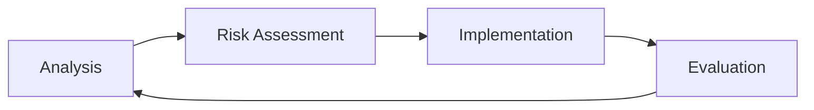

Uses
- Large project
- Risk intensive project
- Has high budget

Adv|Dis
---|---
Thorough risk analysis and mitigation| Expensive to hire risk assessors
Caters to change in user needs | Lack of focus on code efficiency
Produces prototypes with each iteration | High costs due to constant prototyping

- Has 4 key stages:
	- [[Analysis]]
	- Risk assessment and mitigation
	- [[Development]], [[Testing]] and [[Implementation]]
	- [[Evaluation|Evaluating]] for next iteration
- If risk is too great for another iteration it can always be terminated

