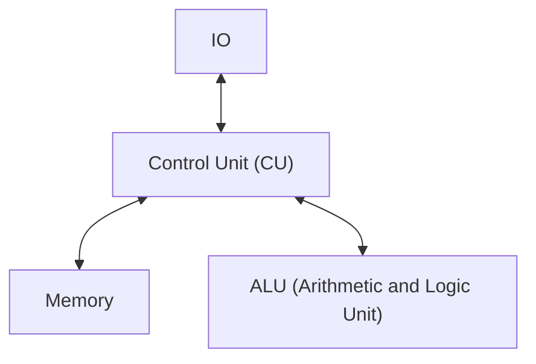

- Has one [[Main Memory|memory]] containing instructions and data
- More common in [[Contemporary|conventional processors]] 

Adv | Dis
-- | --
Cheaper to develop as [[Control Unit (CU)]] is easier to design | Slower execution as data and instruction need to be decoded
Programs can be optimised in size | only one bus has access to [[Main Memory\|memory]] so fetching data is slower

