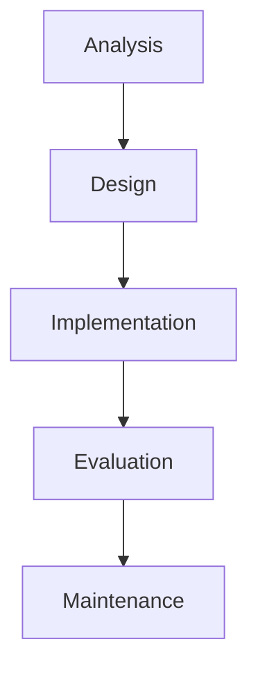

Uses
- Static program
- low-risk projects
- Needs little user input

Adv|Dis
---|---
Easy to manage| Lack of flexibility
Clearly documented| No risk Analysis
. | limited User involvement

- Based on a series of stages that are completed in order
- If change is made programmers must revert back to the stage where the change is being made
- Users are only included at very beginning and end of project

