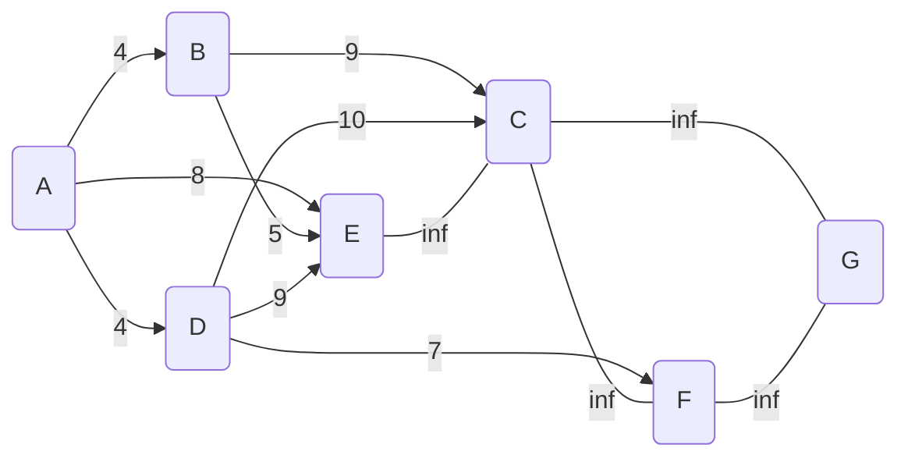
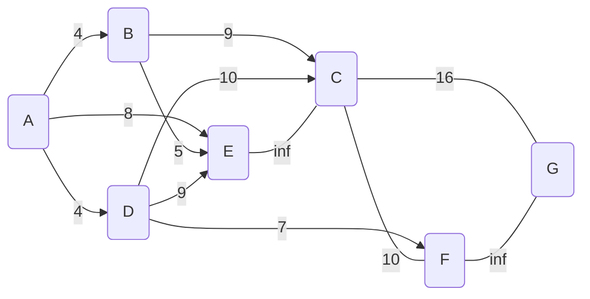
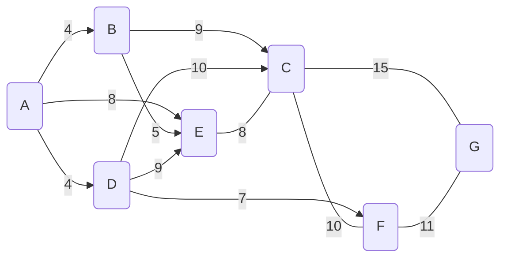

1. a) Dijkstra's shortest path algorithm aims to find the shortest path between 2 nodes in a graph
   b) If there was a node representation of a map you could find the shortest route to travel, or if the map was a train system you could find the least amount of trains that you would have to go on to reach your destination
   c)

	 d) i) A -> B -> E -> C 
	            length:8
		ii) A -> D -> F -> G
			    length:11

2. 

| Q   | Liverpool | Leeds | Manchester | Sheffield | York |
| --- | --------- | ----- | ---------- | --------- | ---- |
|   a | 0         | 75    | inf        | inf       | inf  |
|    b| 0         | 75    | 34         | inf       | inf  |
