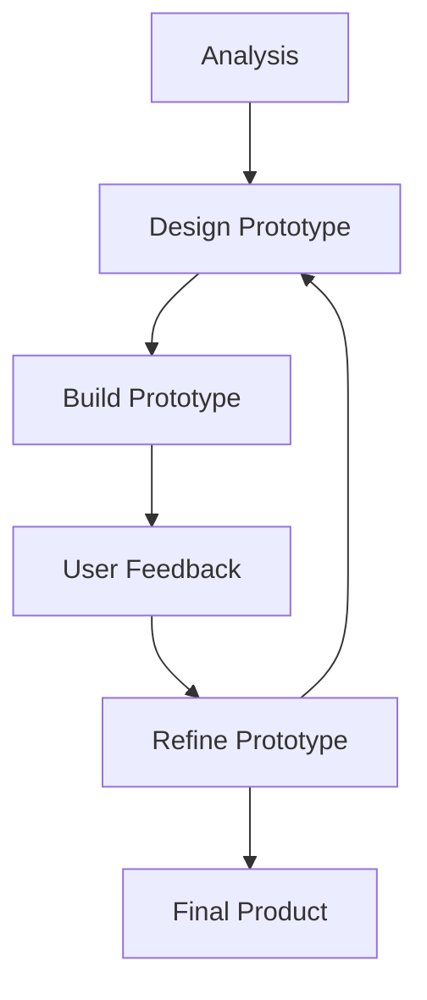

Uses
- Small to medium projects
- Unclear initial requirements

Adv|Dis
---|---
Produces quality code| Poor documentation
Flexible to changing requirements| Requires constant interaction between end-user and programmer
Regular user input makes it user friendly |

- Refers to collection of methodologies
- Aim to improve flexibility of development
- Adept to changes in user requirements faster
- Problem is broken down into sections which are developed in parallel
- Different sections can be at different sections in development
- Prototype is made and improved upon in an iterative manner

