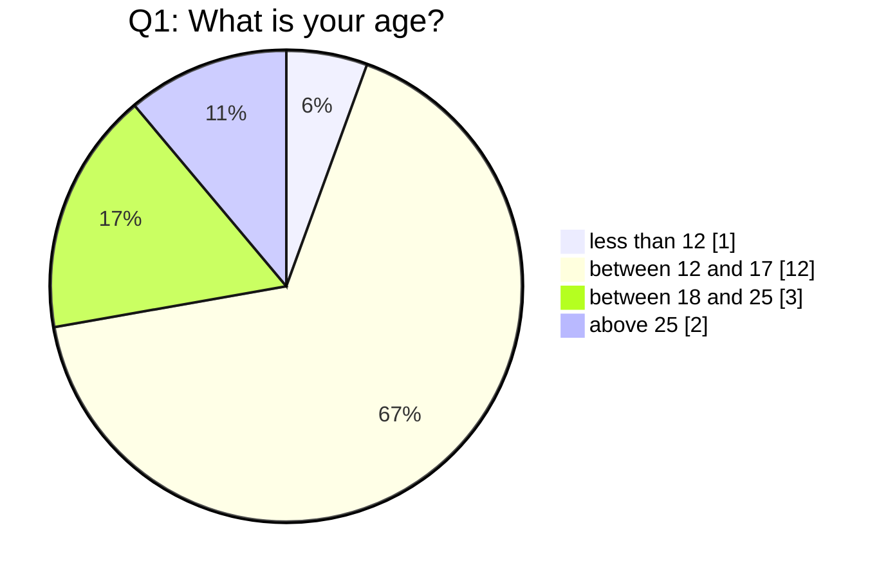
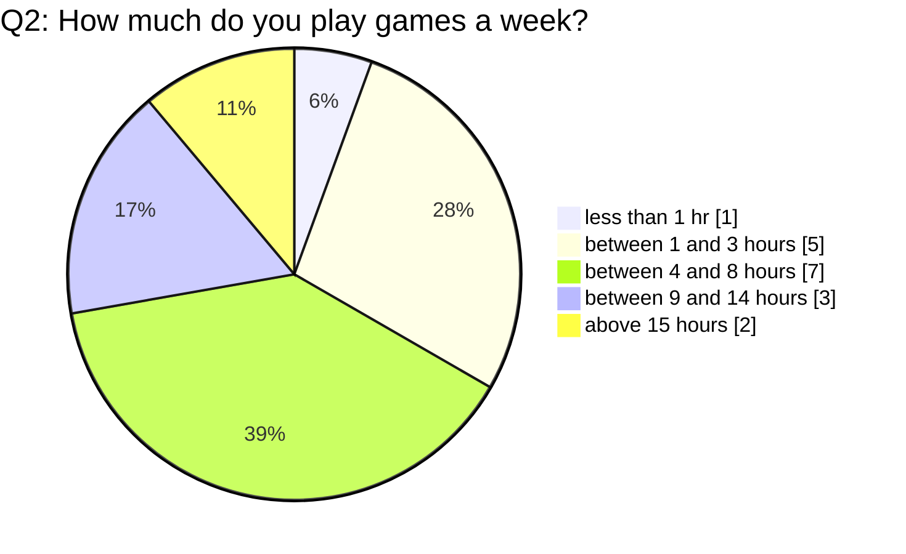
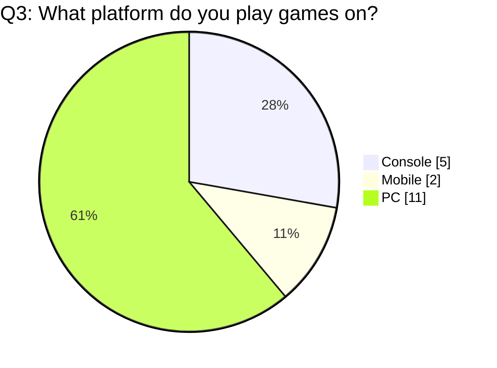
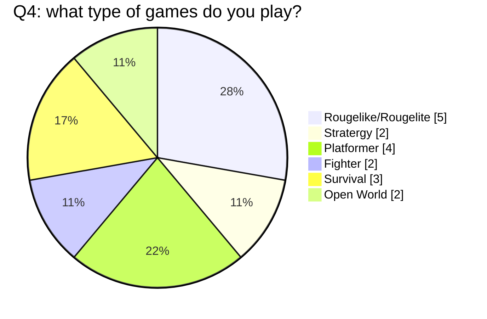
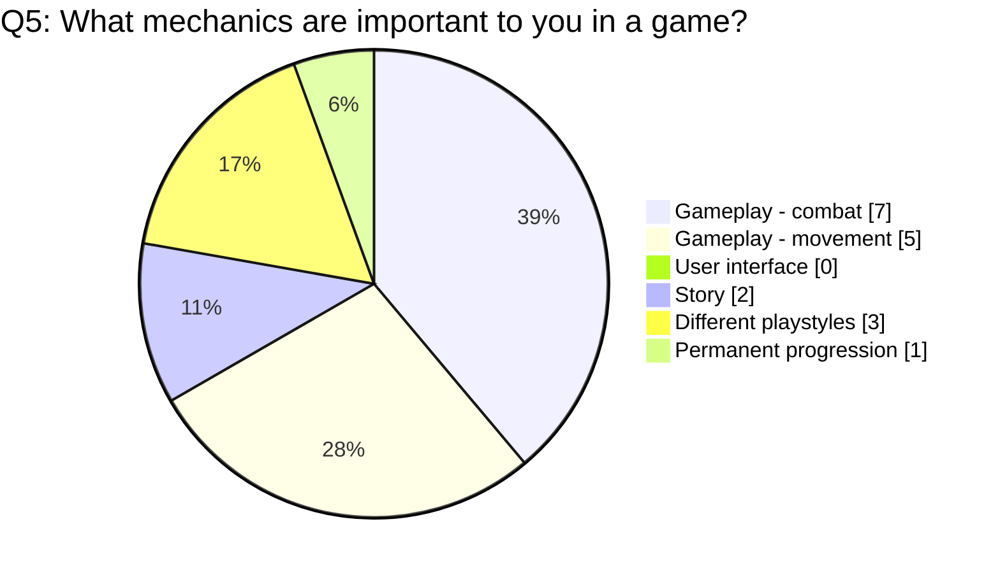
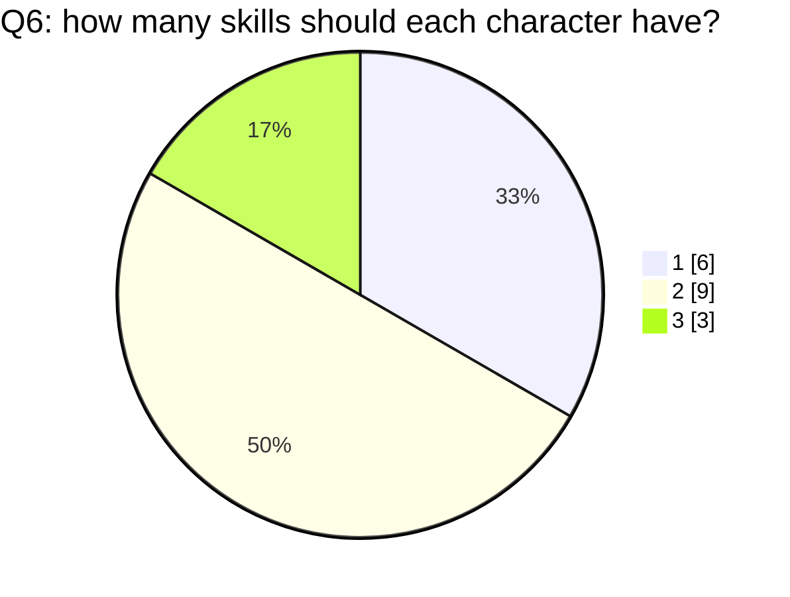
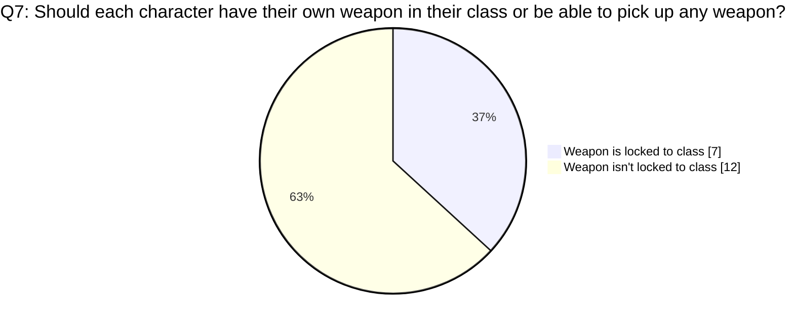

Computer Science 
Advanced GCE H447 
Unit F453

Name: Karol Jeziorczak
Candidate Number: 4162
Centre Name: Rugby High School
Centre Number: 31255

<div style="page-break-after: always;"></div>

# **Sources** 
Name: Procedurally Generated 3D Dungeons
URL: [https://www.youtube.com/watch?v=rBY2Dzej03A](https://www.youtube.com/watch?v=rBY2Dzej03A)
Date Accessed: 05/12/23

Name: Comparing Algorithms for Dispersing Overlapping Rectangles
URL: [https://mikekling.com/comparing-algorithms-for-dispersing-overlapping-rectangles/](https://mikekling.com/comparing-algorithms-for-dispersing-overlapping-rectangles/)
Date Accessed: 05/12/23

Name: Bowyer–Watson algorithm
URL: https://en.wikipedia.org/wiki/Bowyer–Watson_algorithm
Date Accessed: 07/12/23
# **Image sources** 
Name: Risk of Rain 2
URL: [https://store.steampowered.com/app/632360/Risk_of_Rain_2/](https://store.steampowered.com/app/632360/Risk_of_Rain_2/)  
Date Accessed: 25/09/23

Name: Rain World
URL: [https://store.steampowered.com/app/312520/Rain_World/](https://store.steampowered.com/app/312520/Rain_World/)
Date Accessed: 25/09/23

Name: Celeste
URL: [https://store.steampowered.com/app/504230/Celeste/](https://store.steampowered.com/app/504230/Celeste/)
Date Accessed: 25/09/23

<div style="page-break-after: always;"></div>

# **Project Introduction** 
For my project I intend to create a 2D rouge like game which is focuses on melee combat. This game would be like Rain World with Celeste movement

This is because there are few games which focus on melee combat and this would help it stand out, the rouge like aspect would allow every run to be unique and distinct. Allowing people to replay the game multiple times without getting bored. 

The melee combat will be close range and it will allow people to play in distinctive styles, for example people will be able to change their weapon and ability to suit the playstyle that they are looking for, making any play style viable. 

There will be progress through floors. When the player completes one floor they can move on and enter the next floor. At the end of each floor there will be a boss that the player must defeat to progress. 

The loot and map generation will be random meaning that the player cannot memorize the layout and do the same thing every time but need to adjust to the environment, making the game more challenging. 

I plan for there to be different enemies that have different attack patterns that will not be entirely random meaning that the player can learn how to effectively defeat the enemy. The enemy difficulty will increase as the player progresses through the floors. 

# **Computational Methods** 
Computational methods are computer-based methods which are used to solve problems. They are suitable for my project since I want to make a game which is fun and the following concepts allow me to accomplish this 

**Decomposition** – Splitting a large problem into smaller problems which are more manageable. This would help with my project as I am not going to be working in every aspect of the game at once, decomposition allows me to work on one part of the game at a time since debugging one small piece of code with a couple of errors is a lot easier than debugging all the game code with many, many errors 

**Divide and conquer** – Dividing a problem into smaller problems until they are small enough to be solved directly. This would allow me to develop one aspect of the game at a time and make steady progress on the game. Since each aspect is finished and polished by the time I move on to the next aspect. 

**Abstraction** – is removing the additional detail allowing me to focus on the main points rather than wasting time trying to work on pointless detail that will not be noticed. This will allow me to use my time efficiently as the main points will get the most amount of time making the basics of the game reliable. 

**Modular design** – Subdividing the problem into smaller modules in my case these would be: telescreen, physics engine, movement, abilities, characters etc. These allow me to priorities the modules which need more attention and keep organized as each module can have its own separate folder for all the things needed for that module.  

**Algorithms –** Algorithms allow me to implement features that do not need anything but computer processing to be solved. For example, enemies will use an algorithm to detect and attack the player, the scenery might be made by an algorithm etc. These allow the computer to do specialized processing for the problem that needs to be solved 

**Selection** – Allows for choices to be made in the code. For example, if statement is a type of selection since a condition needs to be met for the code to be executed. This is useful in many scenarios, just to list a couple: if the player is in the air, they should not have the ability to jump. If the players health drops to zero they should be sent to the game over screen and many more. 

**Iteration (looping)** - Allows a certain piece of code to be ran multiple times for example while or for loops which will continue to cycle the code until it is told to stop. These are useful since in a 3D game the players input needs to be recorded every frame to minimize latency, the code needs to sort through those inputs every to make the necessary adjustment to the character and environment all in the same frame. These tasks are repetitive therefore the code will be the same every loop and iteration is perfect for that. 

**Visualization** – The player will not be able to process the raw data outputted by the computer therefore it needs to be put in a format which is comprehensible for humans. There will be a lot of data processing while the game is running such as player position constantly moving, enemies moving and attacking the player. If that were outputted as a string of numbers to the player, they would have no idea what is going on therefore visualization is used to allow the user to interact with the program  

**Pattern recognition** – It would be useful for the computer to recognize patterns as a certain pattern could be used as a condition for selection this could be useful as when the player attacks the computer could recognize this and react accordingly to make the fight interesting. Or it can be used in fighting games to make a move since in some games like mortal combat you can chain inputs to do a special attack. 

# **Suitable Stakeholder** 
My game would be suited for people who have more experience with games it will be suitable for any age over the age of twelve (might be a too violent for children under the age of twelve). 

 Therefore, Ethan Armstrong would be a suitable stakeholder. He is 16 years of age therefore he fits the target demographic. He will give feedback through playtesting and according to the feedback I will be able to adjust the difficulty and balance the aspects of the game to fit the genre and style I am going for. The feedback given to me by him will allow me to adjust the game to make it more enjoyable. 

Daniel Cabrel would also be a stakeholder as they are new to gaming therefore, I will be able to make the game more beginner friendly to expand my target audience and make it more appealing to more people. He will also give feedback through playtesting and interviews allowing me to make the game easy to pick up regardless of skill. 

I have chosen these people since they are part of my target demographic and they will help me to make the game easy to pick up yet challenging. 

# **Researching the Problem** 
## **Risk of Rain 2** 
![[School/Computer Science/Course Work/Reports/Images/ROR 2 ss.jpg]]
Risk of Rain 2 is a roguelike, third person shooter. A roguelike game means that when you die in the game you must restart the entire game, which means that it does not take long to complete and it can be replayed multiple times, since it has a large variety of items which can be combined to make many unique runs. It has a unique concept since as the time goes up so does the difficulty, meaning that the more time you spend looting the more powerful enemies become creating a unique stressful and fast paced shooter. 
### **Controls:** 
WSAD - to move 
Space - Jump 
E – To interact with the environment (open crates etc.) 
Q – Activate equipment (item that can be used by every character) 
Ctrl – Toggle sprint (to move faster) 
M1 – Primary Skill (unique to character, usually damaging) 
M2 – Secondary Skill (unique to character, usually damaging) 
Shift – Utility Skill (unique to character, usually movement) 
R – Special Skill (Unique to character, usually heavy damage, and long cooldown) 
Tab – Info Screen (shows the stats of the current run) 
M3 – Ping (allows players to communicate in game) 

### **Characters** 
Commando and Huntress – Both are beginner friendly characters which have a basic set of skills and utility to ease the player into the game. They are the first characters you unlock and they are both good characters even after the player has learn to play the game. 

Every character apart from these two needs some sort of challenge to be completed before the player gains access to them. This allows the player to progress at their own pace. 

Acrid, Artificer, Bandit, Captain, Engineer, MUL-T and REX – Once these characters are unlocked, they expand the possible play styles possible to the play allowing the player to play the game in any way they want to for example, Engineer has turrets and a shield if the player wants to bunker down, while Bandit has an invisibility cloak and shotgun allowing for the player to get close and personal. 

Loader and Mercenary – Both have the highest skill ceiling (lots of things to master) and both have lots of unique tech (advanced strategies to use utility to achieve a certain result) for example Loader can launch out her pylon and grapple to it immediately after launching the player a great distance 

Railgunner and Void fiend – Both DLC characters which is a good example of the developers expanding the play style since none of the other characters had long range and these characters fit that style perfectly since Railgunner has a rail-gun which is like a sniper allowing the player to keep their distance and pick of enemies one by one. 

Heretic – A secret character which is unique since they cannot be unlocked, and the character is bound by the run as they are unlocked by picking up a combination of items on that run. 

### **Aim of the game** 
The aim of the game is to get loot and activate the teleporter, after this a boss will spawn, which you must kill to progress. You get teleported to a different stage and the process repeats until stage 5 and after that you get teleported to the moon to kill final boss (Mythrix) or obliterate yourself which has a more secret ending which needs the player to enter a portal on stage 8 after they loop (return back to stage 1 and keep all their items), sometimes a large purple portal can appear which teleports the player to a different realm (with some pretty interesting lore) and they have to defeat Voidling which gives the player an alternate ending. 
### **Target demographic** 
Teens and older since the game contain blood, drug references and fantasy violence. It is aimed at people with all skill types as the game has different difficulty rating which allows the player to play at the level that they are comfortable with.  
### **Good Qualities** 
- The game is very beginner friendly and is enjoyable both alone and with friends.  
- The variety of items allows the player to replay the game with many different combinations and the game does not feel repetitive. The different ending makes the player want to experience them all.  
- The variety in character makes any play style suitable. 
- The game is never “too easy” since there are eclipse challenges which get progressively harder 
### **Bad Qualities** 
- Once you loop a lot the game gets very chaotic and resource intensive because there are so many enemies with different attributes that can create lots of projectiles which slow down the game a lot.  
- Some things can kill you in one hit making death unavoidable in some cases. 
- Sometimes you get runs where you get no good items, and the game becomes a lot more difficult because of bad luck. 
### **What I would include** 
- The variety in characters and the play styles that they allow 
- The different difficulties allowing the player to play at a level that their comfortable with 
## **Celeste**
![[School/Computer Science/Course Work/Reports/Images/Celeste ss.jpg]]
Celeste is a challenging 2D platformer where the aim is to give precise inputs that will clear the level and allow you to progress into the next room. It takes a long time to complete as the game is very difficult and constantly introduces new features that are harder than the last.
### **Controls** 
WSAD – Movement 
J - Jump
K - Dash
L - Grab
### **Characters** 
Madeline is the protagonist of the game and as the game progresses, as the game progresses they get more and more abilities and the level design reflects this as the game presents rooms that can only be solved with the new skill that the player was shown. The game never gives the character any new skills are just shown to the player and never granted or unlocked meaning that the player can revisit earlier levels and complete them in newer and more efficient ways. The player does get an extra dash in some of the later rooms in the game and this is the only upgrade that the player gets.
### **Aim of the game** 
The aim is to get to the top of the celeste mountain climbing the mountain one room at a time. Rooms get harder the further you progress in the game, the length of these rooms can vary drastically, the same applies to the difficulty. The game itself doesn't have that much levels however each level is very difficult which makes completing one very rewarding.
### **Target demographic** 
Anyone as the game doesn't have any violent or difficult topics discussed, however it will cater better to a slightly older audience because of it's difficulty. The game also targets people who are more experience in platformers as the difficulty of the levels scales quickly.
### **Good Qualities** 
- Beating a room feels rewarding
- Caters who anyone who is willing to try it.
- The movement feels fun
- The movement feels consistent
### **Bad Qualities** 
- Getting stuck on one room can be very frustrating
- To progress far into the game you need to dedicate a lot of time and have a lot of skill
### **What I would include** 
- A similar art style 
- Similar movement system, but something that isn't as complicated so it doesn't overwhelm the player
## **Rain World**
![[School/Computer Science/Course Work/Reports/Images/Rain world ss.jpg]]
Rain world is an open world game meaning that the player can go explore anywhere to their heart's content. It's also very difficult, and focuses on treating the player as part of the ecosystem rather than a separate entity, for this reason enemies treat the player as any other rival creature and focuses on their own survival rather than killing the player, which is common in most other games.
### **Controls** 
WSAD – Movement 
Space - Jump
E - Grab
Q - Throw
Escape - Pause
Z - Map
### **Characters** 
The player plays as a slugcat which is a small creature with the ability to wield rocks and spears. They can also befriend other wild creatures. They can also interact with scavengers if the player's reputation is good with the scavengers, however this isn't the case for all slugcats as scavengers will become hostile if the player's reputation is low. 

Monk - The easy mode of rain world, where enemies are less common and less aggressive. This character is good for people playing the game for the first time as it allows them to experience the game in a less harsh environment than usual.

Survivor - Regular difficulty of the game

Hunter - Hard mode of rain world where some special tougher enemies spawn that don't usually spawn, enemies are also more common and aggressive. There is also a time limit as the hunter has a limited amount of cycles (days) unlike any of the other characters, hunter also has the ability to consume dead animals.

Rain world also has a DLC called downpour which adds 5 new characters, where each character has unique abilities and objectives, the different characters are unique to the base game characters as they have their own abilities which also come with their downsides. Each character is also set at a different time in the timeline meaning that the layout of the game will be similar however each room will be different for each character and the enemies in that area will also be different. These new characters each require a different approach for the game due to their different downsides, for example gourmand gets tiered after throwing a spear, forcing the player to plan their combat as they will get tiered if they spend too long in combat. Whereas the saint isn't able to use spears because it's a pacifist, but they have a grapple which it can use to traverse the land faster, forcing the player to avoid combat at all costs. 
### **Aim of the game** 
The aim for each character in the game varies, however they all need to progress through the environment to reach their goal, often resulting in combat with the wildlife. The player must also gain enough food to be able to sleep in a shelter and avoid the rain that comes at the end of each cycle (game equivalent of a day). Dying results in the player respawning in the shelter they previously slept in and losing a karma point, however for each successful cycle that the player completes they will gain a karma point. Karma is important as it allows the player to traverse between regions, since regions are separated by karma gates which only let you through if your karma is above a certain level. 
### **Target demographic** 
Anyone as it doesn't contain any graphic scenes or references to difficult topics. However the game caters more to people who are willing to spend time trying to understand it as it's a very challenging game which is very harsh for a new player, lacking any kind of tutorial or explanation. 
### **Good Qualities** 
- Gameplay is fun and keeps the player engaged
- Game has a high skill ceiling meaning there is always a way the player can improve 
- Movement is incredibly fun and feels exceptionally smooth. 
- Lack of permanent upgrades makes the game focus on skill rather than items and unlocks.
- Completing a cycle if very rewarding.
- Player is treated as part of ecosystem rather than separate entity
### **Bad Qualities** 
- Difficult to get into due to no tutorial
- Game is very unforgiving and a small mistake can result in the player getting killed
### **What I would include** 
- A similar combat system 
- Similar movement system
- Treating the player as part of the ecosystem
# **Letter to Client** 

Paragraph 1 - Introduce yourself and coursework 
Paragraph 2 – why you have chosen them and what you need from them (interviews and game testing) 
Paragraph 3 – GDPR (General Data Protection Regulation), data protection explain how you will follow these rules 
Paragraph 4 – Thank them for working with you 

31 Bucannon Road 

CV22 6AZ 

20/11/22 

Dear Ethan Armstrong, 

My name is Karol Jeziorczak. I am studying computer science (OCR specification) at Rugby High School; the coursework requires me to create a game. 
I am asking you to become a game tester for my game so that I can get feedback from you as to how to improve the game. In the future I will ask you to give me feedback on the game to improve the quality and usability of the game, this will be in the form of interviews and game testing. This will hopefully improve the quality of the game and allow me to develop this project further into a fully functional product. 
All the data gathered will be kept secure in order with the GDPR (General Data Protection Regulation). This means that your data will be kept secure and will not be shared with any unauthorized personnel. I will do everything that I can to protect your data. However, if the data will get leaked, you will be the first to get notified.  
Thank you for your time and co-operation (if you choose to). I am looking forward to working with you. 

Sincerely,  

Karol Jeziorczak  

# **Stakeholder Questionnaire** 
Some SS of questionnaire talking about GDPR
## **Analysis** 


We can see that the target demographic is teens and above meaning that the game can include some violence. It is important to make the game appropriate to the target demographic as they will be the majority of the player base. 


It is important to balance the progress made and the time invested as if people only play 1-2hrs a day as shown by the questionnaire, it is important to make the player feel like they made progress in that time so that they are willing to continue playing. This could be implemented by each run being 30-40 mins allowing the user to have a couple runs in a session.


Most people answered replied that they play on pc meaning that it should be ported to pc first. A significant amount of people also play on console so it would be good to port the game to console if possible. 

Most people answered Roguelike/Rougelite and platformer meaning I should focus on these two aspects the most when making my game. Survival will be implemented though planning ahead this might be what routes to take and the risk associated with those routes as well as the risk of combat. As well as management of resources to make sure you survive to the next stage. 

Combat and movement were the most common option so they should be the most polished systems in the game. Though different playstyles was something I should consider. Permanent progression wasn't a popular choice so a roguelike style would be more suitable 

Most people answered 2 so it would be important to make the skills distinct and unique to allow for different playstyles. One ability could be active that the user can activate when needed e.g. throwing grenade and it will have a cooldown. The other ability could be a utility skill which can be picked regardless of character and is a limited resource and refreshes once a special item is picked up e.g. throwing knife that does damage, refreshes when more are picked up. There could also be a passive ability that the player doesn't need to do anything to activate it, it will be permanently active in the background (e.g. increased movement speed), this can make every character feel unique. 

The majority wanted to have weapons that are picked up and not locked to a class therefore I will give each character a starting weapon and give them the ability to change this weapon if they wish to, allowing the player to experiment with different weapons that may suit their playstyle.
# **Interview with Stakeholder** 

I – Interviewer (Karol Jeziorczak)   
S – Stakeholder (Ethan Armstrong) 

I: Everything you say here will be recorded and used for development of my game; however, it will not be shared with any unauthorized personnel and your data will protected under the GDPA 

S: I understand and agree to these terms. 

I: Question 1. What is the most important feature to you in a game? 

S: Exploration is very important to me; I love finding out hidden mechanics and secrets. 

I: Question 2. How important is difficulty scaling with progress to you? 

S: It is important to make the game challenging as it will make it more fun to overcome. 

I: Question 3. How often should there be boss fights? 

S: A bit after a new mechanic gets introduced so I have time to get used to it however the boss fight will be a test to see if the player can use the gimmicks 

I Question 4. What type of playstyle do you usually go for? 

S: I usually go for a large health build with heavy weaponry 

I: Question 5. Are there any specific features you would like to see? 

S: I would like to see a power slide because it makes the game seem fast paced. 

I: Question 6. What would a good combat system include? 

S: Enemies not having insane amounts of health as it slows down the pace of the game and makes killing them seem like it takes too long. So, with melee weapons there should be more blocking and skill involved rather than just hitting enemies and them dying? 

I: Question 7. What should the final boss look like? 

S: The final boss should be an enemy foreshadowed by the previous environments that has different mechanics from the different bosses that combine them all into one where they need to be interchanged, with a satisfying dying animation for the final boss.  

I: Question 8. How should the inventory management system work? 

S: I think that there should be a very limited amount of inventory room so that management and planning become very important. Also, so that the focus of the game isn’t shifted too much from the combat, as it is the main focus of the game. 

# **System Requirements** 

## **Minimum Hardware Requirements** 
Processor:   
Graphics Card:   
Memory:   
Storage:   
Sound Card: yes 

Input devices: 
- Keyboard – allows you to input characters 
- Mouse – Inputs 2D vector coordinate for mouse position 

Output devices: 
- Display – Outputs image 
- Speakers – Outputs sound 

## **Minimum Software Requirements** 
OS: Windows 10+   
DirectX version: 12   

# **Success Criteria** 

Using the data gathered from my research phase I will aim to implement the following features: 
*ss of excel sheet*
# **Designing the solution** 

**Decomposition of the problem**   
This is one of the computational methods that I am going to use for my game. This is important as it allows me to think of how the game will work at a basic level. 
## **Main Menu** 
The main menu will be there to greet the player once they open the game and allow them to choose what they would like to do 

These will be in the form of buttons that the user can click on.  

## **Variables** 
Variable – stores some sort of data in main memory 

**Data Types** 
Integer – whole number   
Float – real number   
Character – single letter/symbol   
String – series of characters   
Boolean – true or false   
   
CONSTANT_NAME – represented as capitalized with underscores   
variable_name – represented as lowercase with underscores 
## **Folder Setup** 
*ss of folder setup*
# Actual Coding
## UI Design
## Player Design
### Player Movement
Player movement is something that is important to the feel of the game and is a make or break for many people. A significant number of people said that movement is the most important to them in a game but the majority of the people surveyed answered combat,  therefore I would like to make a movement system that complements the combat system but also isn't overwhelming so that the player can focus mainly on the combat while still enjoying the movement.

Made a checklist so that I can implement all the features one at a time.
Though this checklist did get updated as I decided to include more features into my game and therefore didn't start like this.
- General Movement
	- [ ] Can move left and right
	- [ ] Decelerates when no input is given
	- [ ] Input Buffering
- Jumping
	- [ ] Accelerates player up
	- [ ] Limited amount of jumps
	- [ ] Is there coyote time
- Dashing
	- [ ] Makes the player move fast 
	- [ ] Gets interrupted when hitting wall
- Wall bouncing
	- [ ] When dashing into a wall it bounces into opposite direction
	- [ ] When dashing up a wall it bounces you slightly away from it
	- [ ] When dashing into floor it bounces you back up a bit
- Animation
	- [ ] Sprite is facing the right way
	- [ ] idle animation
	- [ ] Animation for walking
	- [ ] Animation for jumping
	- [ ] Animation for dashing
#### Iteration 1
```c#
using Godot;
using System;

public partial class CharacterCont : CharacterBody2D
{
	public const float Speed = 300.0f;
	public const float JumpVelocity = -400.0f;

	// Get the gravity from the project settings to be synced with RigidBody nodes.
	public float gravity = ProjectSettings.GetSetting("physics/2d/default_gravity").AsSingle();
	public override void _PhysicsProcess(double delta)
	{
		Vector2 velocity = Velocity;
		// Add the gravity.
		if (!IsOnFloor())
			velocity.Y += gravity * (float)delta;
		// Handle Jump.
		if (Input.IsActionJustPressed("ui_accept") && IsOnFloor())
			velocity.Y = JumpVelocity;
		// Get the input direction and handle the movement/deceleration.
		// Need to change ui_direction to a more appropriate button
		Vector2 direction = Input.GetVector("ui_left","ui_right","ui_up","ui_down");
		if (direction != Vector2.Zero)
		{
			velocity.X = direction.X * Speed;
		}
		else
		{
			velocity.X = Mathf.MoveToward(Velocity.X, 0, Speed);
		}
		Velocity = velocity;
		MoveAndSlide();
	}
}
```
- General Movement
	- [x] Can move left and right
	- [x] Decelerates when no input is given
- Jumping
	- [x] Accelerates player up
	- [ ] Limited amount of jumps
- Dashing
	- [ ] Makes the player move fast 
	- [ ] Gets interrupted when hitting wall
- Wall bouncing
	- [ ] When dashing into a wall it bounces into opposite direction
	- [ ] When dashing up a wall it bounces you slightly away from it
	- [ ] When dashing into floor it bounces you back up a bit
- Animation
	- [ ] Sprite is facing the right way
	- [ ] idle animation
	- [ ] Animation for walking
	- [ ] Animation for jumping
	- [ ] Animation for dashing
#### Iteration 2
```c#
using Godot;
using System;
using System.Diagnostics;

public partial class character_movement : CharacterBody2D
{
    //Constants
    public float gravity = ProjectSettings.GetSetting("physics/2d/default_gravity").AsSingle();
    //Presets
    private Vector2 velocity;
    private Vector2 direction;
    private bool facingLeft;
    private bool inDash;
    private Sprite2D sprite;
    //Character presets
    public float Speed = 300.0f;
    public float JumpVelocity = -400.0f;
    public float dashVelocity = 800f;
    public float decelerateRate = 20f;
    public override void _Ready()
    {
        sprite = GetNode<Sprite2D>("CharacterSprite");
    }
    public override void _Process(double delta)
    {
        PlayerInput();
        ManageSprite();
    }
    public override void _PhysicsProcess(double delta)
    {
        #region gravity
        // Add the gravity.
        if (!IsOnFloor())
            velocity.Y += gravity * (float)delta;
        #endregion

        #region move_player
        if (direction != Vector2.Zero)
        {
            velocity.X = direction.X * Speed;
        }
        else
        {
            velocity.X = (float)Mathf.MoveToward(velocity.X, 0f, decelerateRate);
        }
        #endregion

        Velocity = velocity;
        MoveAndSlide();
    }
    private void PlayerInput()
    {
        direction = Input.GetVector("move_left", "move_right", "move_up", "move_down");
        #region Moving
        //gets direction of player input
        if (direction.X < 0f)
        {
            facingLeft = true;
        }
        else if (direction.X > 0f)
        {
            facingLeft = false;
        }
        #endregion

        #region jumping
        // Handle Jump.
        if (Input.IsActionJustPressed("jump") && IsOnFloor())
        {
            velocity.Y = JumpVelocity;
        }
        #endregion

        #region dash
        if (Input.IsActionJustPressed("dash"))
        {
            // If player isn't moving
            if (direction == Vector2.Zero)
            {
                //dash left
                if (facingLeft)
                {
                    velocity -= new Vector2(1f,0f) * dashVelocity;
                }
                //dash right
                else
                {
                    velocity += new Vector2(1f, 0f) * dashVelocity;
                }
            }
            else
            {
                GD.Print(direction.Normalized() * dashVelocity);
                velocity += (direction.Normalized() * dashVelocity);
                GD.Print(velocity);
            }
        }
        #endregion
    }
    private void ManageSprite()
    {
        #region sprite dir
        if (facingLeft)
        {
            sprite.Scale = new Vector2(1f, 1f);
        }
        else
        {
            sprite.Scale = new Vector2(-1f, 1f);
        }
        #endregion
    }
}
```
- General Movement
	- [x] Can move left and right
	- [x] Decelerates when no input is given
- Jumping
	- [x] Accelerates player up
	- [ ] Limited amount of jumps
- Dashing
	- [x] Makes the player move fast
	- [ ] Gets interrupted when hitting wall
- Wall bouncing
	- [ ] When dashing into a wall it bounces into opposite direction
	- [ ] When dashing up a wall it bounces you slightly away from it
	- [ ] When dashing into floor it bounces you back up a bit
- Animation
	- [x] Sprite is facing the right way
	- [ ] idle animation
	- [ ] Animation for walking
	- [ ] Animation for jumping
	- [ ] Animation for dashing
#### Iteration 3
```c#
using Godot;
using System;
using System.ComponentModel.Design;
using System.Diagnostics;
using System.Threading.Tasks;

public partial class character_movement : CharacterBody2D
{
    //Constants
    public float gravity = ProjectSettings.GetSetting("physics/2d/default_gravity").AsSingle();
    //Presets
    private Vector2 velocity;
    private Vector2 direction;
    private Sprite2D sprite;
    private Area2D climbCollider;
    private bool facingLeft;
    private enum playerState
    {
        idle,
        walking,
        airBorn,
        dashing,
        dashEndLag,
        noResistance
    }
    private playerState state;
    private float frameDelta;
    private float time;
    //Character presets
    public float decelerateRate = 100f;
    public float noResDecelerateRate = 1f;
    //moving
    public float speed = 5000.0f;
    public float jumpVelocity = -400.0f;
    //bounce
    public float bounceVel = 50f;
    public float bounceDir = 80f; //in degrees
    public float bounceNoResLength = 0.1f; //in s
    //dash
    public float dashVelocity = 800f;
    public float dashLength = 0.1f; // in s
    public int endLagLength = 50; //in ms
    
    public override void _Ready()
    {
        sprite = GetNode<Sprite2D>("sprite");
        climbCollider = GetNode<Area2D>("climbBox");
    }
    public override void _Process(double delta)
    {
        frameDelta = (float)delta;
        direction = Input.GetVector("move_left", "move_right", "move_up", "move_down");
        ManageState();
        ManageSprite();
        Movement();
        Velocity = velocity;
        GD.Print("acc Vel:"+Velocity);
        GD.Print(state);
        MoveAndSlide();
    }
    private void Movement()
    {
        #region gravity
        // Add the gravity.
        if (state == playerState.airBorn || state == playerState.noResistance)
            velocity.Y += gravity * frameDelta;
        #endregion

        #region speed_control
        if (state != playerState.dashing && state != playerState.noResistance)
        {
            velocity.X = (float)Mathf.MoveToward(velocity.X, 0f, decelerateRate) * frameDelta;
        }
        else if (state == playerState.noResistance)
        {
            velocity.X = (float)Mathf.MoveToward(velocity.X, 0f, noResDecelerateRate) * frameDelta;
        }
        #endregion

        #region move_player
        if (direction != Vector2.Zero && (state != playerState.dashing) && (state != playerState.noResistance))
        {
            velocity.X = direction.X * speed * frameDelta;
        }
        else if (state == playerState.noResistance)
        {
            velocity.X += direction.X * speed * frameDelta;
        }
        #endregion

        #region jumping
        // Handle Jump.
        if (Input.IsActionJustPressed("jump") && IsOnFloor() && (state != playerState.dashing))
        {
            velocity.Y = jumpVelocity;
        }
        #endregion

        #region dash
        if (Input.IsActionJustPressed("dash")) //init dash
        {
            time = 0f;
            state = playerState.dashing;
            // If player isn't moving
            if (direction == Vector2.Zero)
            {
                if (facingLeft) //dash left
                {
                    velocity -= new Vector2(1f,0f) * dashVelocity;
                }
                else //dash right
                {
                    velocity += new Vector2(1f, 0f) * dashVelocity;
                }
            }
            else // dash in whatever direction facing
            {
                velocity = (direction.Normalized() * dashVelocity);
            }
        }
        if (state == playerState.dashing) //when in dash
        {
            if (climbCollider.HasOverlappingBodies() && Input.IsActionPressed("jump")) //check for wallbounce
            {
                state = playerState.noResistance;
                velocity.X *= -1f;
                velocity += BounceVel(bounceVel,bounceDir);
            }
        }
        #endregion
    }
    private void ManageSprite()
    {
        #region sprite dir
        if (facingLeft)
        {
            sprite.Scale = new Vector2(1f, 1f);
            climbCollider.Scale = new Vector2(1f, 1f);
        }
        else
        {
            sprite.Scale = new Vector2(-1f, 1f);
            climbCollider.Scale = new Vector2(-1f, 1f);
        }
        #endregion

        #region which_dir_facing
        //gets direction of player input
        if (direction.X < 0f)
        {
            facingLeft = true;
        }
        else if (direction.X > 0f)
        {
            facingLeft = false;
        }
        #endregion
    }
    private void ManageState()
    {
        // Handle player state
        if (state == playerState.dashEndLag)
        {
            return;
        }
        else if (state == playerState.dashing)
        {
            time += frameDelta;
            if (time >= dashLength)
            {
                EndDash();
            }
            return;
        }
        else if (state == playerState.noResistance)
        {
            if (IsOnFloor())
            {
                state = playerState.idle;
            }

            time += frameDelta;
            if (time >= bounceNoResLength)
            {
                state = playerState.idle;
            }
            return;
        }
        else if (!IsOnFloor())
        {
            state = playerState.airBorn;
            return;
        }
        else if (direction == Vector2.Zero && IsOnFloor())
        {
            state = playerState.idle;
            return;
        }
        else if (direction != Vector2.Zero && IsOnFloor())
        {
            state = playerState.walking;
            return;
        }

    }
    private void EndDash()
    {
        state = playerState.dashEndLag;
        velocity = Vector2.Zero;
        Task.Delay(endLagLength).ContinueWith(t => ToIdle());
    }
    private void ToIdle()
    {
        state = playerState.idle;
    }
    private Vector2 BounceVel(float mag, float dir)
    {
        if (facingLeft)
        {
            return new Vector2(mag * MathF.Sin(dir), -mag * MathF.Cos(dir));
        }
        else
        {
            return new Vector2(-mag * MathF.Sin(dir), -mag * MathF.Cos(dir));
        }
    }
}
```
- General Movement
	- [x] Can move left and right
	- [x] Decelerates when no input is given
- Jumping
	- [x] Accelerates player up
	- [ ] Limited amount of jumps
- Dashing
	- [x] Makes the player move fast
	- [ ] Gets interrupted when hitting wall
- Wall bouncing
	- [x] When dashing into a wall it bounces into opposite direction
	- [x] When dashing up a wall it bounces you slightly away from it
	- [x] When dashing into floor it bounces you back up a bit
- Animation
	- [x] Sprite is facing the right way
	- [ ] idle animation
	- [ ] Animation for walking
	- [ ] Animation for jumping
	- [ ] Animation for dashing
#### Iteration 4
- General Movement
	- [x] Can move left and right
	- [x] Decelerates when no input is given
	- [ ] Input buffering
- Jumping
	- [x] Accelerates player up
	- [x] Limited amount of jumps
	- [ ] Is there coyote time
- Dashing
	- [x] Makes the player move fast
	- [x] Gets interrupted when hitting wall
- Wall bouncing
	- [x] When dashing into a wall it bounces into opposite direction
	- [x] When dashing up a wall it bounces you slightly away from it
	- [x] When dashing into floor it bounces you back up a bit
- Animation
	- [x] Sprite is facing the right way
	- [ ] idle animation
	- [ ] Animation for walking
	- [ ] Animation for jumping
	- [ ] Animation for dashing
### Player Abilities

## Level Design
Planning to use a similar algorithm to the one mentioned in the "Procedurally Generated 3D Dungeons" The algorithm can be decomposed into some subprograms where
- General shape is generated
- Other stuff (I will come back to this)
### General shape Generation
Started with generating a finite amount of rooms and separating them until there are no overlaps between all the rooms.
#### Iteration 1
Started with generating all the rooms within a small confined area. Then separating them all at once by checking each room, one by one and if it's overlapping with any other room. It will move in the opposite direction of the centre of the other room making all the rooms spread out gradually.
![[rooms seperated.png]]
Product of algorithm
##### Problems encountered
Lots of loops need to be carried out for the algorithm to spread out all the rooms, for 100 rooms it took around 275,000 changes in positions of the rooms to generate a solution which is very inefficient and takes approximately an entire minute to compute, the complexity of the algorithm is polynomial $O(n^{k})$ due to the nested loops used in the algorithm. 
This may not be a concern since this algorithm is only executed once at the start of each run in the game. However this is still only the first step of the algorithm. The inefficiency could be because when the difference in positions are calculated, the distant overlapping rooms have a greater effect on the displacement of the original room, whereas the rooms close to the original room don't have as much of an impact. After this was altered the average changes in positions decreased to around 120,000 changes in position, taking around 15 seconds. 
#### Iteration 2
## Enemy Design
### Enemy Movement

### Enemy AI