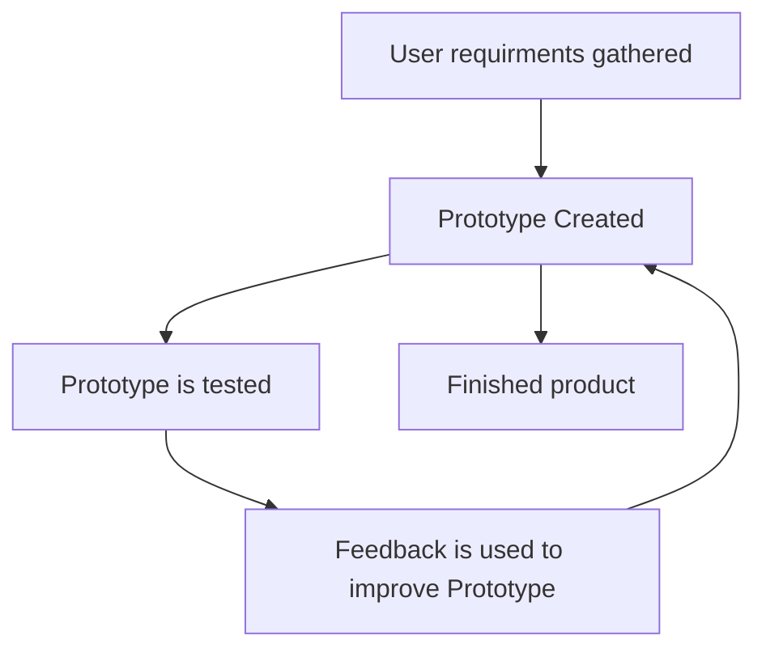

Uses
- Small to medium projects
- low-budget
- Short time frame

Adv |Dis
---|---
Caters to change in user requirements | Poor documentation
Highly usable finished project| Fast pace may reduce quality
Focus more on core features, reducing development time | 

- Iterative methodology
- Partially functional prototypes are continually built upon
- User requirements are initially gathered the using that an initial prototype is made
- Initial prototype is given to user of feedback then is used to generate the next improved prototype
- Repeats until finished

